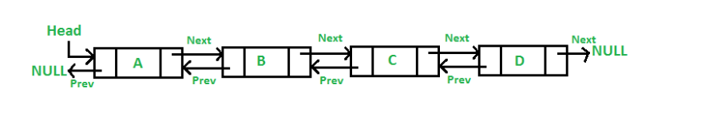

## Getting Started

Welcome to the Double Linked List, i will explain you about this material. 

## Basic Must To Know
Sebelum kesini pastiin kamu udah ada basic beberapa hal berikut :
1. Java Dasar
2. Java OOP
Source ?, ada banyak jangan manja.
> Yutub :
  1. Kelas terbuka
  2. Programer zaman now
  3. Bro Code(English Version)

## Who Am I
Anugrah Gilang Ramadhan

## Let's Start
Apa itu double linked list ? Doubly Linked List (atau daftar berantai dua arah) adalah struktur data linear yang terdiri dari serangkaian elemen yang dikenal sebagai "node." Setiap node memiliki dua bagian: satu bagian yang mengandung data dan satu atau lebih bagian yang menunjuk ke node sebelumnya (previous node) dan node berikutnya (next node) dalam daftar. Konsep dasar dari doubly linked list mirip dengan linked list biasa (satu arah), tetapi dengan tambahan kemampuan untuk bergerak maju dan mundur melalui elemen-elemen dalam daftar.
 > Kelebihan
   1. Manajemen struktur data yang baik
   2. Meminimalisir penggunaan memory
Jadi secara sederhana double linked list bakal nyambungin data perdata yang kalian masukin atau kalian input sesuai dengan keinginan kalian naruhnya dimana, dan satu sama lain data itu terhubung. Secara teknis tempet data ditaruh tu disebut node ya.
Nah jadi di double linked list itu ada dua hal yang harus kalian pahamin, penting. Jadi dalam setiap node pasti memiliki 2 petunjuk arah, yaitu Node next dan Node previous. Buat lebih ngerti liat ni visualnya :



Nah ada beberapa yang perlu kalian latih buat mahamin ini. Cara paling gampang yaitu CD, atau Create Delete. Dengan ini kalian
bisa banget latihan gimana sih cara kerja dan cara untuk otak atik si double linked list ini.

## Setup package
Nah disini gw makeknya OOP konsep class,objek dan inheritance ada juga konsep constructor.
CLass -> Gw buat class Main, Class Node. Inheritance nya yaitu doublelinkedlist, dimana ini merupakan extends dari Node, jadi di Node gw cuma buat kerangka Node-node nya nah eksekusi method, property dan sebagainya itu ada di class anaknya.
Konsep objeknya yaitu pada class Main, gw makek objek data1 dimana data1 diisi dengan property yang beragam.
Ikutin aja proses nya ntar jg lu paham gimana gw mainin proses nya. Nah untuk constructor itu ada di awal banget di class anak dari Node, gw ngisi this.head = null, this.tail = null, kenapa ? karena belum diisi, sebenernya ga dikasi kayak gitu juga it's okay, nah guna constructor ini adalah kita gaperlu capek-capek manggil argument nya satu-satu, jadi kalian kayak dalam satu panggilan udah include beberapa value yang buat di Node nya. Gini-gini gw paham lu pada pusing, kan gini biasanya buat manggil di code biasanya, kalo mau ngisi value kayak contoh nama, pasti data1.nama, gitu kan atau ga di loop, nah constructor ni biar satu kali jalan aja semua ngisi data nya. data1(nama, nim) gitu misalnya, nah itu sama aja kayak data1.nama dan data1.nim.

## Create Data
Logika dari create data yaitu ketika semua nya masih null, atau belum ada data dan node dalam wadah yang bakal kita isi. Gambarannya gini, kalian punya ember, tapi kalian belom ngisi air nya sama sekali. Nah buat di dalam codingan foldernya di `/src/myclass/doublelinkedlist` kalian bisa liat ada function create first data. 
> Penjelasan
Karena belum ada data jadi logikanya kita bakal isi data pertama kali, dimana data itu pasti bakal jadi head sekaligus tail nya. Nah gini lu mesti inget dalam setiap node itu ada next dan prev, tapi di head prev nya null dan di tail next nya null gitu aja. Jadi gini coba deh lu liat code nya. Hal pertama itu lu buat dulu/inisialisasi Node baru yang menandakan bakal ada node yang ditambah nih gitu, nah katakanlah namanya newnode. Cara inisialisasi liat code nya aja ya.
> Contoh visual nya gimana gini :


Nah jadi bukan ujung kiri kepala dan ujung kanan kaki nya ya, jadi maksudnya di satu Node udah sekaligus jadi kepala + kaki nya. head sama tail nya maksud gw.

## add first and add last
> add first
Nah logika disini harus main, kalo kita mau nambahin data ke awal banget artinya sebagai head dong ya, nah berarti data first yang kita buat sebelumnya kegeser dan ngga jadi head lagi. Best jalur lu ngertinya gini `tambah node > kaitkan newnode.next nya ke first data tadi, nah kaitkan head.prev ke newnode supaya dia jadi tail nantinya, dan newnode jadi head` kalo belum kebayang liat gambar ini visualnya sambil liat code juga ya.


Alurnya udah jelas ya tinggal try hard ngertiin dan coba aja.

> add last
Sama sebenernya kayak add first cuman yang lu mainin adalah bagian belakang/tail sebelumnya aja sih, tail sebelumnya kan create first data yang kegeser sama add first tadi. Alur logikanya gini `newnode.prev ke tail, newnode next nya ke null(karena bakal jadi tail), dan tail.next nya ke newnode, abis tu tinggal ganti tail, tail = newnode`

Nih visualnya biar kebayang


## add middle
add middle sebenernya konsep nya sama, cuman disini kita butuh satu curent node sebagai penghitung buat si ke posisi yang mau kita ubah. Simple nya gini, pertama buat node baru namanya curent, nah isi si curent ini dengan head `node curent = head` agar si curent nge duplicate head, bukan ganti head ya, cuman duplicate posisi, abis tu kalian looping sampai sebelum posisi, kenapa ? tujuannya karena kita bakal ubah diantara sebelum posisi dan di posisi yang kita ubah, gini misal mau ubah data 3 artinya nambah data nya di antara 2 dan 3 dong, bukan di 3 nya. Buat logikanya ada di code nya ya, nah visualnya gini


## delete first, last, middle
Konsep delete sih sama aja ya, mainin node.next sama node.prev nya aja. Gini misal hapus di awal artinya head.next yang bakal jadi head kan ? iya ga ? so logika delete first itu `head = head.next, head.tail = null`

visualnya gini :


kalo last gimana ? ya tinggal gini `tail = tail.prev` karena yang bakal jadi tail adalah sebelum si tail yang bakal dihapus, terus tinggal `tail.next = null` dah gitu doang.

visualnya gini :


delete middle ? nah ini konsep nya hampir sama kek add middle tapi yang perlu lu perhatiin itu adalah lagi-lagi prev dan next nya, konsep nya adalah sama lu buat curent isinya head terus lanjut kek gini :
```
Node del = curent.next;
        curent.next = del.next;
        del.next.prev = curent;
        del.next = null;
        del.prev = null;
```

nah itu ada node del, fungsinya supaya ada singgahan biar data nya ga putus gitu aja, jadi curent kan sebelum posisi yang dihapus ya, nah curent.next nya arahin ke del.next, kan isi del itu adalah posisi node yang dihapus, abis tu lu arahin si setelah posisi dihapus bagian prev nya ke sebelum del supaya tetep nyambung, terus tinggal lepasin next dan prev si del, dah gitu aja si.

nih visualnya


## last but not least

Selamat mencoba, jangan cepet nyerah ngertiin logikanya emang susah cuman gw dah simplein isinya harus nya lu pada ngerti yak semangat-semangat


## Who am i
ANugrah Gilang Ramadhan
